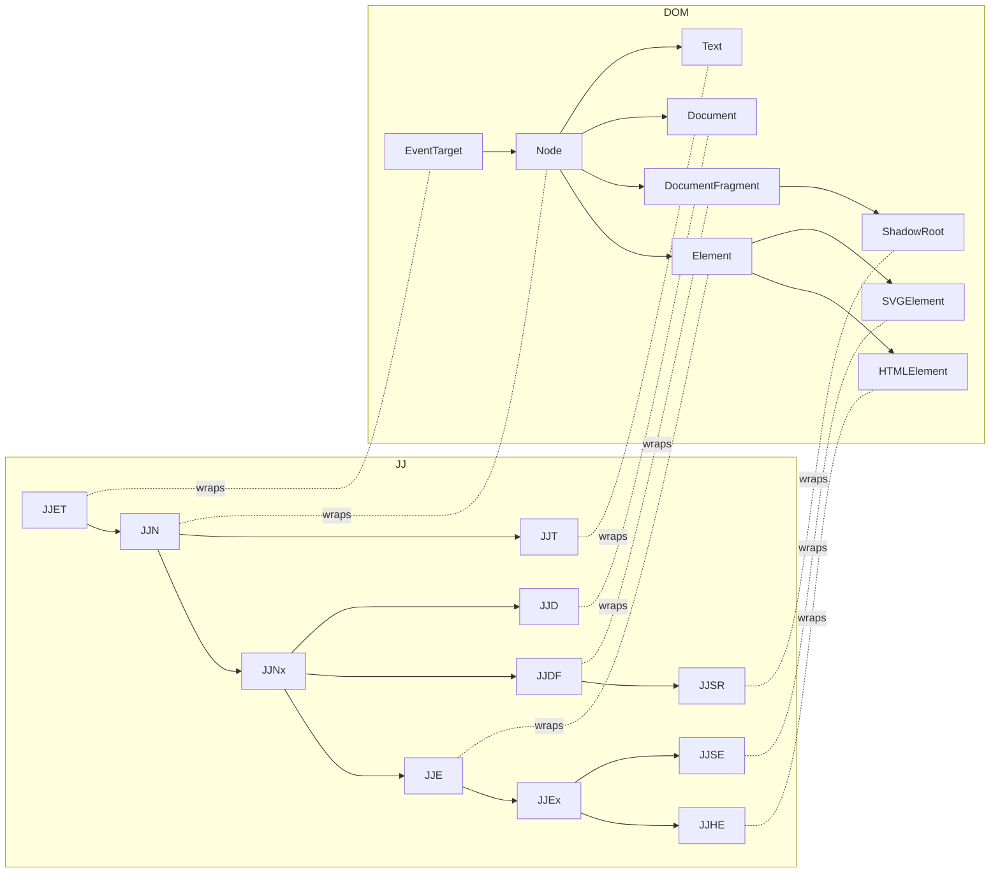

# Wrapper Mental Model

A key implementation idea in JJ is wrappers.

Wrappers add sugar syntax on top of native DOM constructs without monkey-patching or modifying browser prototypes. Each wrapper keeps a stable pointer to the native object via `.ref`.

## How to use this in practice

- Use `JJD.from(document)` when starting document-level work.
- Use `JJHE.create()` for HTML elements, `JJSE.create()` for SVG, `JJME.create()` for MathML.
- Query with wrapper methods (`find`, `findAll`, `closest`) and keep chaining.
- Reach for `.ref` only when you need a native API JJ does not wrap.

This hierarchy is why JJ can return specific wrappers for parent/children traversal while still keeping the API compact.
