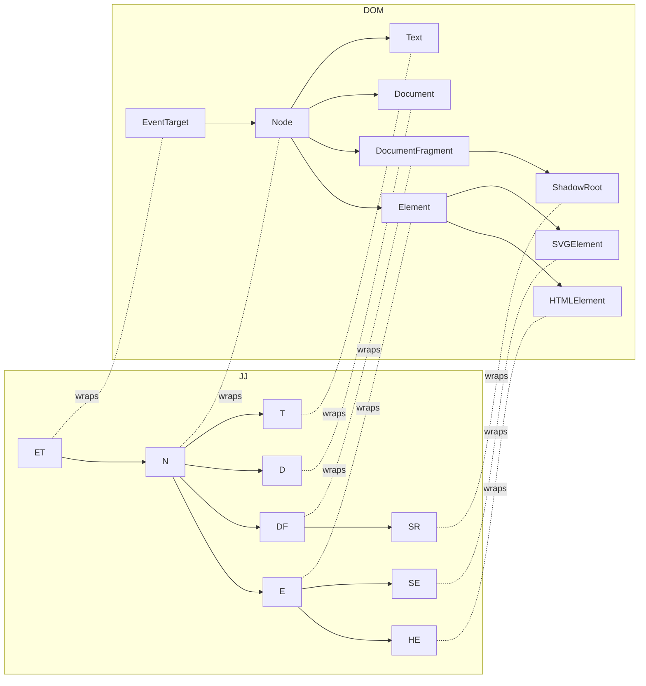

A key implementation idea in JJ is wrappers. The wrappers add the sugar syntax on top of DOM standard constructs without monkey patching or modifying them.

```mermaid
flowchart LR
    subgraph JJ
        ET --> N

        N --> E
        N --> DF
        N --> D
        N --> T

        DF --> SR

        E --> HE
        E --> SE
    end

    subgraph DOM
        EventTarget --> Node

        Node --> Element
        Node --> DocumentFragment
        Node --> Document
        Node --> Text

        DocumentFragment --> ShadowRoot

        Element --> HTMLElement
        Element --> SVGElement
    end

    ET -.wraps.- EventTarget
    N -.wraps.- Node
    DF -.wraps.- DocumentFragment
    SR -.wraps.- ShadowRoot
    D -.wraps.- Document
    T -.wraps.- Text
    E -.wraps.- Element
    HE -.wraps.- HTMLElement
    SE -.wraps.- SVGElement
```
